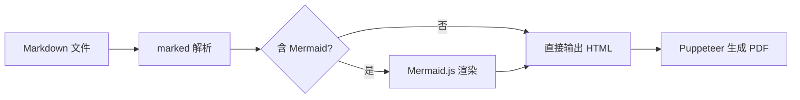
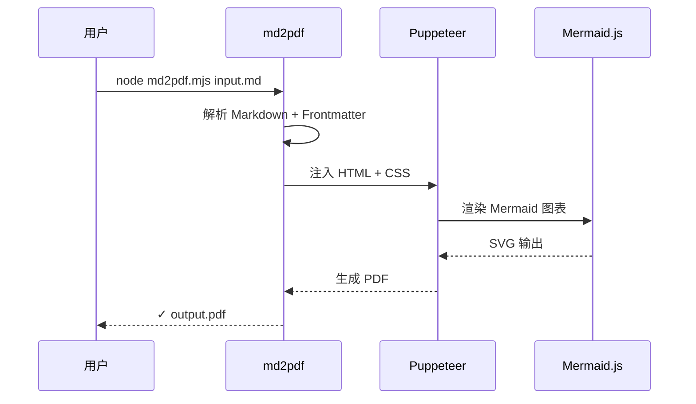
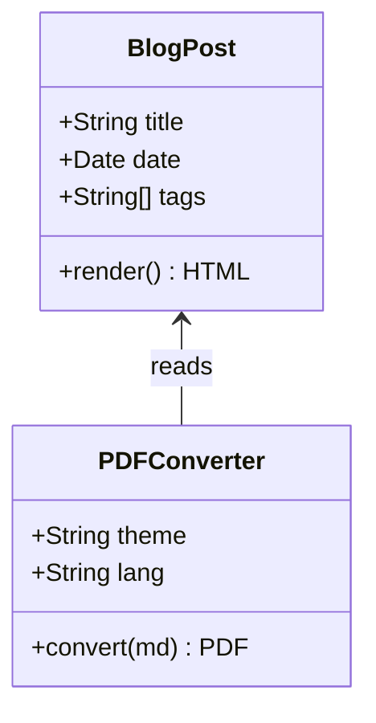

## 文字排版

这是一段正文文本。**加粗**、*斜体*、~~删除线~~、`行内代码`、<u>下划线</u>、<mark>高亮文字</mark>。

> 这是一段引用文字。引用块会有紫色的左边框，文字颜色会变为灰色。
>
> 多行引用也完全支持。

## 代码块

```typescript
interface BlogPost {
  title: string;
  date: Date;
  tags: string[];
}

async function fetchPosts(lang: 'zh' | 'en'): Promise<BlogPost[]> {
  const response = await fetch(`/api/posts?lang=${lang}`);
  return response.json();
}
```

```python
def fibonacci(n: int) -> list[int]:
    """生成斐波那契数列"""
    a, b = 0, 1
    result = []
    for _ in range(n):
        result.append(a)
        a, b = b, a + b
    return result

print(fibonacci(10))
```

## Mermaid 图表

### 流程图



### 时序图



### 类图



## 表格

| 名称         | 类型     | 默认值   | 说明           |
|:------------|:--------:|--------:|:--------------|
| `--dark`    | flag     | false   | 使用暗色主题    |
| `--lang`    | string   | zh      | 文档语言       |

## 列表

- Astro 5.x 静态站点生成
- 支持中英文双语 (i18n)
  - 自动路由切换
  - 语言感知字体栈
- KaTeX 数学公式渲染
- Mermaid 图表渲染

## 数学公式

行内公式：$E = mc^2$，以及 $\int_0^\infty e^{-x^2} dx = \frac{\sqrt{\pi}}{2}$。

$$
\nabla \cdot \mathbf{E} = \frac{\rho}{\varepsilon_0}
$$

---

按下 <kbd>Cmd</kbd> + <kbd>K</kbd> 打开搜索。
